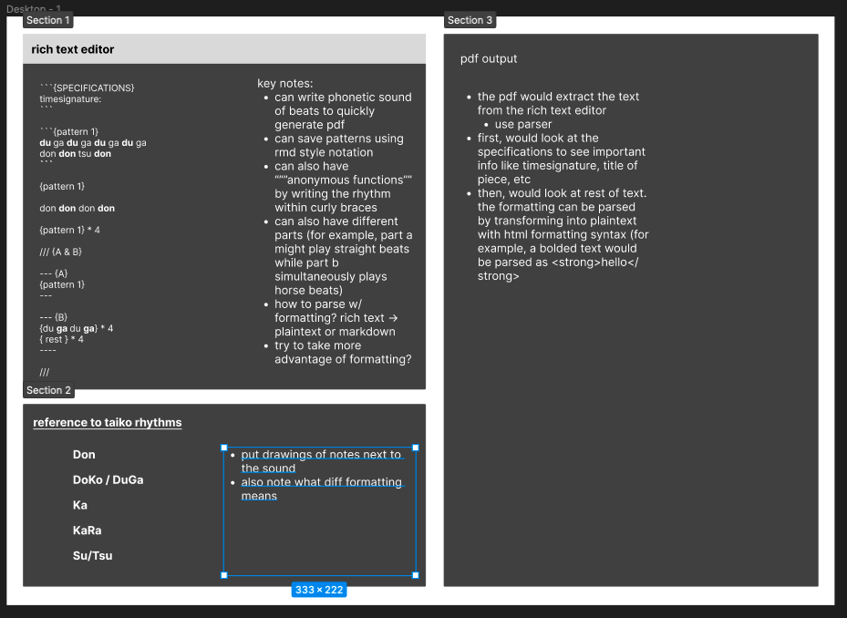

# Design notebook entry

## Last week's critique

**TODO:** Fill in this part with a summary and reflection on the critique you
received for last week's work. Answer questions such as:  How, specifically, did
the feedback help improve the project? Did the feedback point out or offer
something you hadn't considered? Did it help you make a design decision? Was it
helpful in addressing the most pressing issues in your project? How will you
incorporate the feedback into your work? Will you change something about the
design, implementation, or evaluation as a result?

Chris showed me this DSL regarding drum patterns
(https://www.researchgate.net/publication/321018319_A_Domain_Specific_Language_For_Drum_Beat_Programming)
which seemed interesting, so I looked into it! It's interesting because it
operates by defining drum types (for example, a beat can either be a X or an O).
I found it interesting because of how it manipulated Haskell's strengths, but
I'm not sure how much of it I'll incorporate into my project. In a sense,
though, how the drum types are defined are kind of similar to how I'll use a
parser to parse my text. Both look for certain patterns and recurse until they
hit a terminal symbol of some kind!ß

## Description

**TODO:** Fill in this part with information about your work this week:
important design decisions, changes to previous decisions, open questions,
exciting milestones, preliminary results, etc. Feel free to include images
(e.g., a sketch of the design or a screenshot of a running program), links to
code, and any other resources that you think will help clearly convey your
design process.

This week, I was mostly figuring out the design of my language. I protoyped this
using figma, a site that lets you sketch out what you want your product to look
like. Here is a screenshot below.



For my language, I decided to rely on formatting rich text a lot in order to
decrease verbosity. For example, my code might look something like

**du** ga **du** ga **du** ga du ga

where the bold indicates that you hit with your right hand. This is because
typically, your right hand is also called the "strong hand" because it hits with
more force. This seems to map nicely to bolding, which is why I made this
decision.

I also decided to make it easy to reuse patterns. For example, suppose I had a
rhythm that repeated every 16 measures. Rather than rewrite it everytime, I
could save it to a variable and call it whenever I needed it after defining it
only once. I decided to implement this using a markdown style implementation.

```{"pattern 1"}
du ga du ga du ga du ga
don don tsu don
```

{"pattern 1"}

The three backticks indicate that we're starting a "code block" where we define
our rhythm. We give that rhythm a name (pattern 1, in this case) and pass it in
as a string. Then, we can call it later using {patternName} syntax.

Additionally, I added some tricks for reptition. Taking after a Pythonic syntax, you can
represent repetition by using an asterisk.

{"pattern 1"} * 4, for example, would repeat pattern 1 four times.

This introduced the need for anonymous rhythms because what if you wanted to do
repetition with a rhythm that wasn't repeated anywhere else? In that case, you
could do something like this:

{du ga du ga} * 4

Which would repeat du ga du ga four times.

In taiko, there are many times where people will split into different parts
after playing in unison for a while. To remedy this, I tried doing something
like the following:

/// {A & B}

--- {A}
{pattern 1}
---

--- {B}
{du ga du ga} * 4
{ rest } * 4
----

///

This would represent parts A and B, where perhaps half of the players would play
pattern 1, and the other half would play the rhythm described in {B}. But then I
want to edit it so it looks something like this instead, to resemble markdown
more

> "A & B"

``` {> A}
{pattern 1}
```

``` {> B}
{du ga du ga} * 4
{ rest } * 4
```

This also adds a sense of consistency with the fact that {name} means a rhythm
block. The greater than sign typically means a blockquote in markdown, or a
subset of a whole, so making this represent sections in my language makes sense
to me. The > in front of the pattern name just distinguishes it from other
rhythm blocks.

In terms of other logistics, I decided to use Javascript for this project since
that's what I'm familiar with. I also found a library that could be helpful in
processing my plaintext and exporting it to a pdf: https://www.vexflow.com


## Questions

**What is the most pressing issue for your project? What design decision do
you need to make, what implementation issue are you trying to solve, or how
are you evaluating your design and implementation?**

I did > to represent different sections, but if I wanted to add other music
notation like crescendo/decrescendo, using this symbol might conflict. It seems
more intuitive that to represent that, I would use < or >. A solution could be to use
>> and << instead...


**What questions do you have for your critique partners? How can they best help
you?**

Reading through my plaintext representation of music, how does it feel to you?
Anything that seems jarring?

**How much time did you spend on the project this week? If you're working in a
team, how did you share the work?**

Maybe 3 hours? 

**Compared to what you wrote in your contract about what you want to get out of this
project, how did this week go?**

It went alright! I think I got a majority of my goals done, even if I wasn't
able to actually start coding yet. I have a solid direction that I want to
pursue, which is basically all I was hoping from this week.
