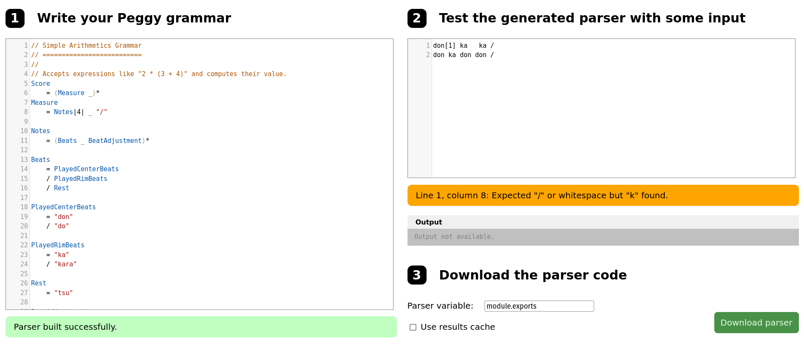

# Design notebook entry

## Last week's critique

**TODO:** Fill in this part with a summary and reflection on the critique you received for
last week's work. Answer questions such as:  How, specifically, did the feedback help
improve the project? Did the feedback point out or offer something you hadn't considered?
Did it help you make a design decision? Was it helpful in addressing the most pressing
issues in your project? How will you incorporate the feedback into your work? Will you
change something about the design, implementation, or evaluation as a result?

Olivia mentioned that the syntax for splitting into two sections seemed a bit too verbose.
I agree with this, but am at a slight loss in how to make it more concise. Currently, there 
are 3 parts to it: First is the parts definition (where you say how many parts there will be and
define their names. For example, A&B). Then, two more parts where each represents the different part (one would represent A, the other B). I'm not sure how I could make it more concise.

## Description

**TODO:** Fill in this part with information about your work this week:
important design decisions, changes to previous decisions, open questions,
exciting milestones, preliminary results, etc. Feel free to include images
(e.g., a sketch of the design or a screenshot of a running program), links to
code, and any other resources that you think will help clearly convey your
design process.

I'm a little behind on work this week from a combination of ASP and EB,
unfortunately... I basically worked on setting up the project a little more by
creating the necessary html and javascript files. 

I then fiddled around with the language that I wanted to create. While I had a
vague idea last week, I tried to hammer out more of the details this week by
actually creating a song in my language. First, I wrote out the sheet music
using Noteflight. This took a weirdly long amount of time because it took me a
while to figure out how long each beat actually was; I memorized the whole song
a year ago, but I couldn't tell if something was a 16th note or 8th note. I was
essentially just going off vibes the entire time. 

Once I got what the sheet music would look like, I tried to figure out how I
would write that in my language. One of the issues I quickly came across was the
fact that there isn't really a specific sound associated with 16th notes. That
is, a quarter note is typically represented by saying "don", eighth note is
"do", but there isn't really something after that.

To remedy this, I ended up adding a system where if I wrote "don[1/4]", that would mean
I take the rhythm of the current note (don, a quarter note which is 1/4) and divide it by 4
to get a sixteenth note (1/16). This is called a BeatMod (beat modifier). 

I played around more with the language using Peggy.js (the parser)'s online editor so that 
I could quickly test out code.

One thing I realized while doing this parser is that I'll probably have to create an 
environment of some sort because I want to save repeated patterns as variables...I might let that 
feature take a backseat for now, though.

## Questions

**What is the most pressing issue for your project? What design decision do
you need to make, what implementation issue are you trying to solve, or how
are you evaluating your design and implementation?**

The syntax of the music javascript library is kind of a nightmare, so I'm trying to figure
that out as best as I can. One thing I hate is how it can't automatically detect when to 
start a new measure given notes...You have to create a new measure manually.

**What questions do you have for your critique partners? How can they best help
you?**

Honestly, not a lot because this was just more wrangling with the language. It would be nice
if they could tell me how comprehensible it seems, though!

**How much time did you spend on the project this week? If you're working in a
team, how did you share the work?**
4~5 hours

**Compared to what you wrote in your contract about what you want to get out of this
project, how did this week go?**

Not as much as I hoped to, to be honest. I hope to make it up this week, but am unsure because this week
is also incredibly busy...we'll see!