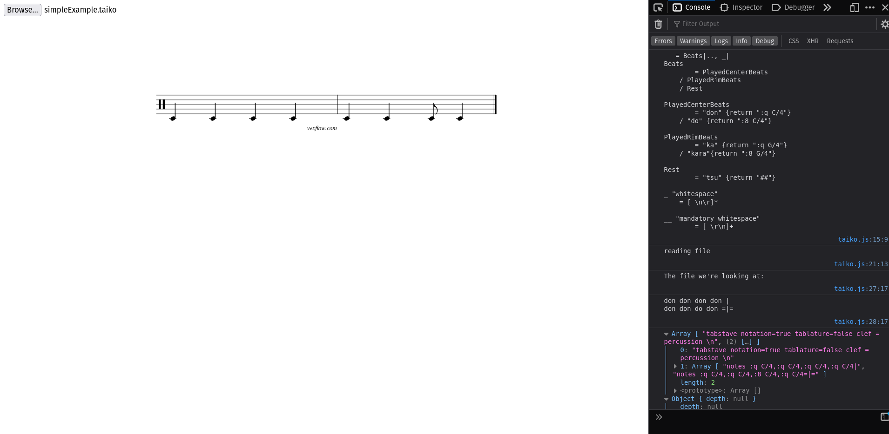

# Design notebook entry

## Last week's critique

**TODO:** Fill in this part with a summary and reflection on the critique you received for
last week's work. Answer questions such as:  How, specifically, did the feedback help
improve the project? Did the feedback point out or offer something you hadn't considered?
Did it help you make a design decision? Was it helpful in addressing the most pressing
issues in your project? How will you incorporate the feedback into your work? Will you
change something about the design, implementation, or evaluation as a result?

There was some advice on reducing verbosity. For example, I had wanted to create a pattern with
this synatx:

```{"Pattern a"}
don don don
```

A simple solution that Chris pointed out was to just have 1 backtick instead of 3. It's a very
minor adjustment, but that's 4 less keystrokes one would have to do so I think I'll incorporate that!

I also had an issue where there wasn't always a name for a specific note. For instance, we have "don" for 
a quarter note, and "do" for an eighth, but none for a sixteenth. Gabriel suggested making up a name for sixteenth notes, but I feel like the issue isn't just specifically the 16th note. There may be a bit of a slippery slope where we just start making up a lot of syntax that people are not necessarily familiar with which defeats the point of having the language be similar to what people already use. For that reason, I'd like to stick with this format for now. 

## Description

**TODO:** Fill in this part with information about your work this week:
important design decisions, changes to previous decisions, open questions,
exciting milestones, preliminary results, etc. Feel free to include images
(e.g., a sketch of the design or a screenshot of a running program), links to
code, and any other resources that you think will help clearly convey your
design process.

I spent a solid hour trying to figure out why my parser wasn't working. It kept
telling me that it was finding a whitespace instead of end of input, and I was
very confused. However, after a while of struggling, I figured out that it was
because I accidentally deleted the space from my whitespace rule; see:

	
_ "whitespace"
    = [ \\n\\r]*

Instead of [ \\n\\r], I had done [\\n\\r] which was a mistake. 

Once I fixed that, I could continue finishing up my parser. Last week, I had
worked on just creating the grammar itself, but did not manipulate the output.
This time, I worked on connecting my grammar to VexFlow, which is what will
generate the music sheet.

However, [VexFlow](https://www.vexflow.com/) was super annoying to work with.
Here is a sample of what the code looks like just to create one measure.
```js
const { Factory } = Vex.Flow;

// Create a VexFlow renderer attached to the DIV element with id="output".
const vf = new Factory({ renderer: { elementId: 'output' } });
const score = vf.EasyScore();
const system = vf.System();

// Create a 4/4 treble stave and add two parallel voices.
system.addStave({
  voices: [
    // Top voice has 4 quarter notes with stems up.
    score.voice(score.notes('C#5/q, B4, A4, G#4', { stem: 'up' })),
   
    // Bottom voice has two half notes, with stems down.
    score.voice(score.notes('C#4/h, C#4', { stem: 'down' }))
  ]
}).addClef('treble').addTimeSignature('4/4');

// Draw it!
vf.draw();
```

So I struggled to work with this verbose library for a while, before discovering
VexTab. VexTab is a derivative of VexFlow, except it's much more concise. It
focuses on writability, which was perfect for my needs. For example, here is a
sample of what VexTab looks like:

```
tabstave notation=true tablature=false
notes Cn-D-E/4 F#/5
```

As you can see, it's much neater to work with. 

So using VexTab, I worked on connecting my language to VexTab so I could
generate sheet music. To do this, I made a very barebones site where you can
choose to upload a file. Once you upload the file, my code reads its contents
and then feeds it into the parser. Afterwards, I take the parser output to
convert my language into VexTab. It will then display on the website.




## Questions

**What is the most pressing issue for your project? What design decision do
you need to make, what implementation issue are you trying to solve, or how
are you evaluating your design and implementation?**

I was able to get a prototype working, but I still need to add in many features.
I think the next one I'd like to tackle is beat modification.

**What questions do you have for your critique partners? How can they best help
you?**

As of this moment, not much! I'm just working on implementing a lot of the 
details I outlined in my pitch. 

**How much time did you spend on the project this week? If you're working in a
team, how did you share the work?**

4 hours, give or take?

**Compared to what you wrote in your contract about what you want to get out of this
project, how did this week go?**

I think I got more done this week than others, but there were still a lot of
bottlenecks where a syntax error/not understanding the library prevented me
from making conceptual progress. I'm not sure how much of my contract I'll be 
able to fulfill, especially having patterns saved in variables as that would
involve creating an environment to store my data, but we'll see. At the very
least, I hope to get beat modifications done.