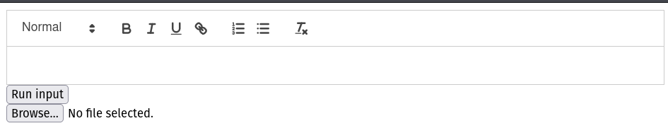
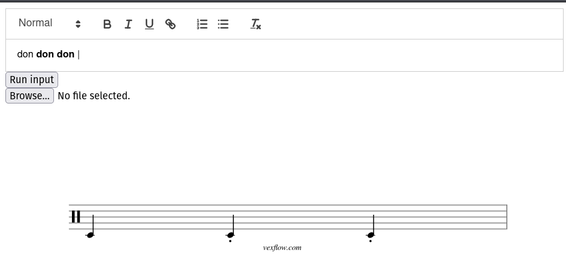
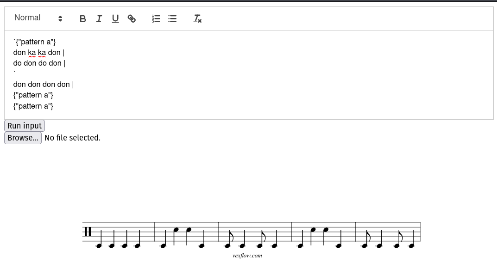

# Design notebook entry

## Last week's critique

**TODO:** Fill in this part with a summary and reflection on the critique you received for
last week's work. Answer questions such as:  How, specifically, did the feedback help
improve the project? Did the feedback point out or offer something you hadn't considered?
Did it help you make a design decision? Was it helpful in addressing the most pressing
issues in your project? How will you incorporate the feedback into your work? Will you
change something about the design, implementation, or evaluation as a result?

I incorporated feedback from last (last?) week about conciseness in
pattern-making. Originally, I was going to have three backticks every time
you define a pattern, but instead I took Chris' advice and just had it be one,
like
```
`{"pattern}
don don |
`
```

I also noted that Gabriel mentioned letting people define their own variable
names like

```
let da = don[2]
```

This way, instead of doing don[2] don[2] don[2] over and over again, you could
do da da da. This would be especially useful if your taiko group has a different
way of saying something, so you could even do let da = don. 

This is a feature I may implement in the coming week if I have enough time.

## Description

**TODO:** Fill in this part with information about your work this week:
important design decisions, changes to previous decisions, open questions,
exciting milestones, preliminary results, etc. Feel free to include images
(e.g., a sketch of the design or a screenshot of a running program), links to
code, and any other resources that you think will help clearly convey your
design process.

First, I changed the site I'm hosting my language a little so that instead of
only uploading a file, you can also type directly into a textbox. I used a
library called Quill.js for this because it supports rich text formatting, which
I want (especially tbe bold feature). This was a fairly easy transition to make;
here is what the site looks like after adding the textbox in.



More importantly, I was able to get my main features working! I first started by
implementing the bold formatting for my text; that is, I had wanted a way to
distinguish a way between hitting the drum with your left hand and with your
right hand. I had hoped that there was an easy way to switch from rich text
editing to plain text such that if I have bold text "don", I could easily
translate it to "<bold>don</bold>" and then have my parser interpret that.
Unfortuantely, this wasn't true so I had to write my own JS function that would
look at the input and then manually transform the text to include the <bold>.
This wasn't too difficult though because when you inspect the contents of the
textbox, Quill gives you back an object in the form of
```
{
  "ops": [
    {
      "insert": "don "
    },
    {
      "attributes": {
        "bold": true
      },
      "insert": "don don"
    },
    {
      "insert": " |\n"
    }
  ]
}
```

As you can see, it will separate out the bolded text, and you can tell what
object is bolded because it will have an attribute of bold: true. So based on
this, I could write a function that would equivalently output

```don <bold>don don</bold> |```

Afterwards, I rearranged the grammar so that this change could be reflected in
the output. Specifically, I made it so that every bold note had a staccato
underneath it, so right hand = staccato. Here is an example:



I also worked on beat modifications, to account for when you want to have notes
beyond quarter and eighth notes. The process for this wasn't too bad, I just
had to readjust the grammar again. As a reminder, the beat modification 
process was this: suppose you have don, which is a quarter note. don[2]
would be equivalent to 1/4 * 1/2, so you'd get an eighth note. 

I then worked on introducing patterns, which was a main goal of mine. Essentially
the idea was that you don't have to type the same patterns over and over again. 
Instead, you can do something like this:

```
`{"pattern name"}
don don don don |
don do do don |
`
{"pattern name"}
```
You first define the pattern with the backticks, and then call the pattern. This
was interesting because it involved having a way to save variables somewhere.
Thankfully, this was pretty doable because I could just have a global variable
called hashmap and everytime a pattern definition was called, I'd save the
pattern into the hashmap with the key "pattern name". Then, every time you see
{"pattern name"} called, you can get the value from the hashmap and substitute
it in. This looks something like this (there's also an example of beat mod):



## Questions

**What is the most pressing issue for your project? What design decision do
you need to make, what implementation issue are you trying to solve, or how
are you evaluating your design and implementation?**

I think I'm pretty much done feature-wise. I want to focus on polishing up 
the interface of the whole thing so it isn't as barebones. I also need to
write some sort of documentation so people know how to use it.

**What questions do you have for your critique partners? How can they best help
you?**

Things that might be useful to have on the site, maybe? So far, I'm thinking
of having a container that tells what notes relate to what (ex: don = quarter 
note). In that case, should I just have the entire documentation on the same
website so people don't have to flip back and forth?

**How much time did you spend on the project this week? If you're working in a
team, how did you share the work?**

6 hrs

**Compared to what you wrote in your contract about what you want to get out of this
project, how did this week go?**

I think this week went really well! I managed to implement a lot of features
that I didn't think I'd have time for, so I'm pretty pleased with my progress.
